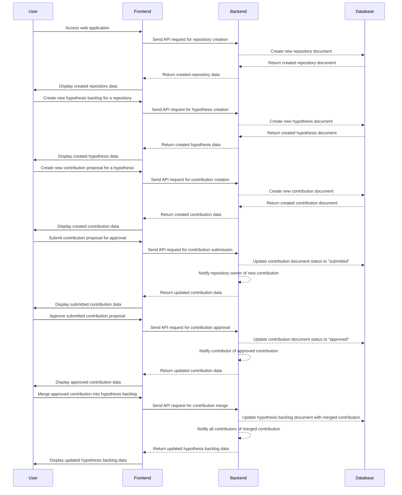

# 研究課題管理アプリケーション DesignDoc
## 概要
研究課題のレポジトリごとにバックログを仮説の形で積み上げて研究過程を整理し、実証結果やデータ、仮説の改善点、再実験の結果などを管理するWebアプリケーションを構築する。

研究者同士がより手軽に共同研究を行えるようにすることを目的とし、提案と受け入れはGitHubのプルリクエストとマージのような形式で行う。

## 技術スタック
- フロントエンド: React
- バックエンド: Node.js
- データベース: MongoDB
## 機能要件
### 課題の作成・編集
- 課題は仮説の形で作成できる
- 課題にはタイトル、詳細、状態、優先度などを設定できる
- 課題にはファイルの添付が可能
- 課題を削除することができる
- 課題の状態を変更できる
### コメント
- 課題に対してコメントを追加できる
- コメントにはファイルの添付が可能
- コメントを削除することができる
### プルリクエスト
- 課題に対してプルリクエストを送信できる
- プルリクエストにはタイトル、説明、変更内容、テスト結果などを設定できる
- プルリクエストに対してコメントを追加できる
- プルリクエストを削除することができる
- プルリクエストをマージすることができる
### ユーザー管理
- ユーザーの登録・ログインができる
- ユーザー情報の編集ができる
- ユーザーの一覧を表示できる
- 管理者ユーザーはユーザーの承認・拒否ができる
## データベース設計
### 課題
|フィールド名|データ型|
|----|----|
|_id	|ObjectId|
|title	|string|
|description	|string|
|status	|string|
|priority	|string|
|attachments	|array|
|created_at	|date|
|updated_at	|date|

## シーケンス図

### ユーザー認証・認可
- ユーザー認証はJWTを用いた認証を採用する
- ユーザー認証が必要なAPIに対しては認可を行う
- 認証・認可に失敗した場合は401エラーを返す
### バックログの管理
- バックログは仮説として提出できる形式を採用する
- バックログはレポジトリごとに存在し、レポジトリの管理者が承認することで公開される
- 承認されたバックログにはコントリビューションポイントが与えられる
- バックログは提出者自身や他の研究者からの提案を受け付けることができる
- バックログにはコメントや実証結果、再実験の結果などを追加することができる
### レポジトリの管理
- レポジトリはGitHubと同様の形式で作成され、管理者が設定を行うことができる
- レポジトリの管理者は承認されたバックログのみを公開することができる
- レポジトリの管理者はユーザーのアクセス権限を設定できる
- レポジトリにはREADMEやコードのアップロードができる
### 研究者の履歴書
- コントリビューションポイントがあるバックログを提出した研究者は、そのポイントが履歴書に反映される
- 履歴書には研究者が提出したバックログの一覧やコントリビューションポイントが表示される
- 履歴書には研究者のプロフィール情報も表示される

## クラスダイアグラム

## シーケンスダイアグラム

